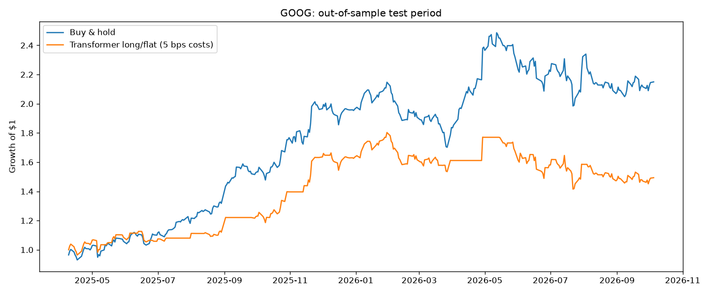

# Stock Transformer

A small Transformer encoder that predicts the next day's return from the last 60 days of price and
volume indicators. Tested on GOOG, SPY, MSFT and AAPL.

- chronological 70/15/15 train/validation/test split, scalers fit on train only
- target is the next day's log return
- early stopping on validation loss
- baselines: predict zero return, predict the average return, always predict "up"
- long/flat backtest on the test period with 5 bps trading costs

## Results

Test period: Apr 2025 to Oct 2026 (374 trading days).

| ticker | model RMSE | best baseline RMSE | direction accuracy | always "up" | strategy | buy & hold |
|---|---|---|---|---|---|---|
| GOOG | 0.0193 | 0.0191 | 49.6% | 52.0% | +49% | +115% |
| SPY | 0.0091 | 0.0085 | 51.1% | 55.3% | +24% | +44% |
| MSFT | 0.0183 | 0.0183 | 52.1% | 52.7% | +41% | +37% |
| AAPL | 0.0164 | 0.0160 | 46.8% | 53.7% | +10% | +69% |

The model doesn't beat the baselines on any ticker. Daily returns are very hard to predict from
past prices alone.



## Running it

```bash
pip install -r requirements.txt
python trader.py --ticker GOOG --plot
```
